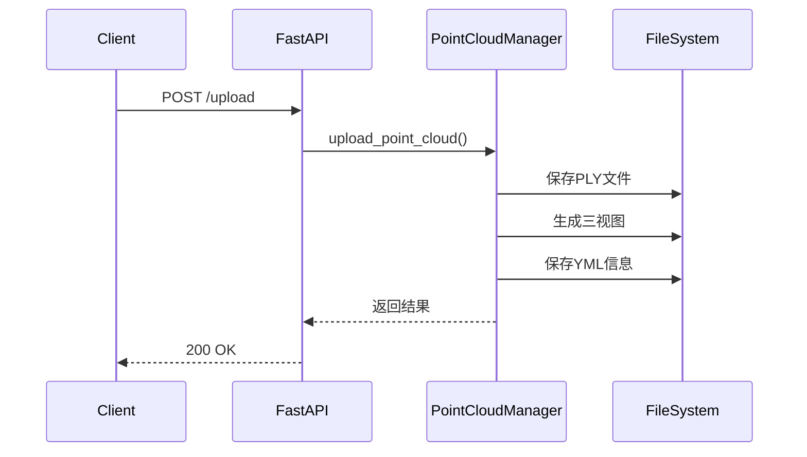
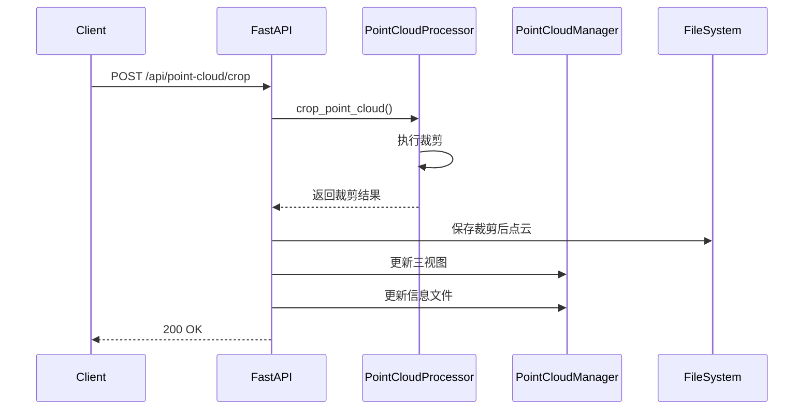
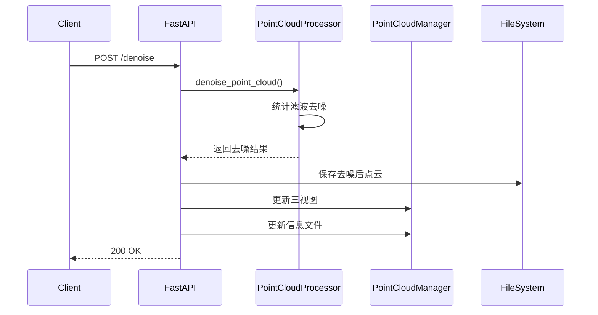
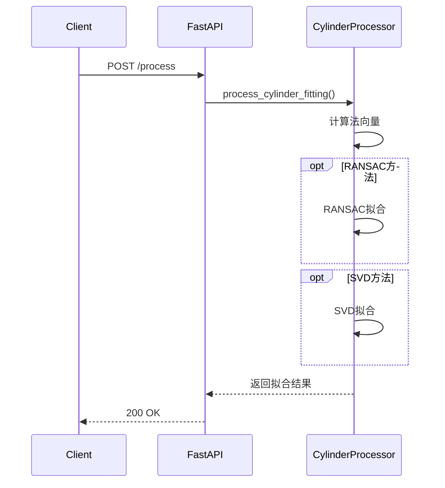

# 后端交互流程

## 点云上传流程



## 点云裁剪流程



## 点云去噪流程



## 圆柱体拟合流程



## 错误处理流程

```mermaid
sequenceDiagram
    participant Client
    participant FastAPI
    participant Processor
    participant Logger
    
    Client->>FastAPI: 任意请求
    FastAPI->>Processor: 处理请求
    
    alt 成功场景
        Processor-->>FastAPI: 返回结果
        FastAPI-->>Client: 200 OK
    else 验证错误
        Processor->>Logger: 记录错误
        Processor-->>FastAPI: 抛出ValueError
        FastAPI-->>Client: 400 Bad Request
    else 处理错误
        Processor->>Logger: 记录错误
        Processor-->>FastAPI: 抛出RuntimeError
        FastAPI-->>Client: 500 Server Error
    end
