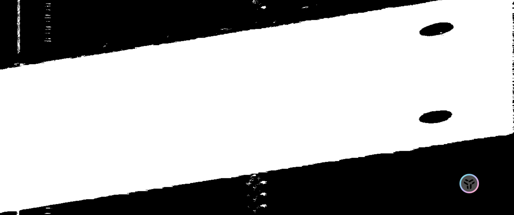
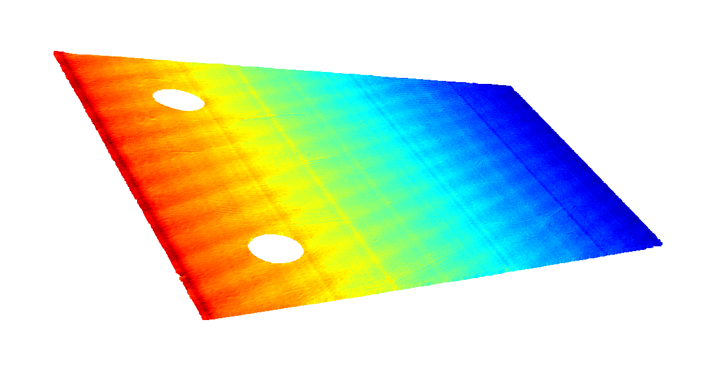
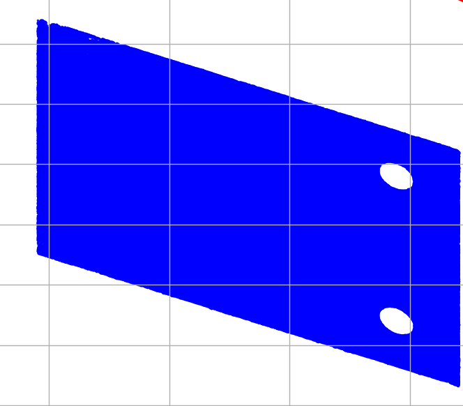

# 标定
## 为什么一定要进行标定
必须进行标定操作。假如不进行标定，取得的点云在y轴会有一倍率。

我们推导最终圆柱方程会变成怎么样

$$
(x-x_{0})^2+(y-y_{0})^2+(z-z_{0})^{2}-\frac{((x-x_{0})v_{1}+(y-y_{0})v_{2}+(z-z_{0})v_{3})^2}{v_{1}^2+v_{2}^2+v_{3}^2}=r^2
$$
$v_{1}=\alpha,v_{2}=\beta,v_{3}=0$
$$
(x-x_{0})^2+(y-y_{0})^2+(z-z_{0})^{2}-{((x-x_{0})\alpha+(y-y_{0})\beta})=r^2
$$
$y'=\beta y \implies y=\frac{1}{\beta}y'$
$$
(x-x_{0})^2+(\frac{1}{\beta}y'-y_{0})^2+(z-z_{0})^{2}-{((x-x_{0})\alpha+(\frac{1}{\beta}y'-y_{0})\beta})=r^2
$$

$x=x_1$
$$
(x_{1}-x_{0})^2+(\frac{1}{\beta}y'-y_{0})^2+(z-z_{0})^{2}-{((x_{1}-x_{0})\alpha+(\frac{1}{\beta}y'-y_{0})\beta})=r^2 \tag{1}
$$

这里既不能使用的PCA（不管是RubusPCA还是普通PCA），因为其沿轴截面不是圆，而是圆心变化的椭圆。推导过程省略，给出仿真图片结果。

这里也不能直接使用C++中的RANSC来找出圆柱轴，因为式1本质上就不是圆柱，椭圆柱都不是。

至于其他方法，比如可以直接对式一进行七个参数的最小二乘，但耗时巨大且效果不佳。比如可以对截面求椭圆方程，但是由于我们取的圆心角都比较小，椭圆求解十分不准，经过思考，还是要进行标定。

标定只是用于确定整个点云沿y轴的缩放比例，至于圆柱的轴，我们后面还是要用来找出来。

## 标定方法
#TODO:现有的标定方法 以及精度分析

这里直接使用架子上的平板进行标定，使用点云采集软件采集点云。
1. 平台降至28
2. 调整ROI区域，使得能成像
3. 适当调整曝光
4. 一键调整参数
    2 50 20 70 即可
    > 由于这里只能设置整数倍的移动速度，所以我们这里只能设置为2，实际我们真正的移动速度在2.5，这里有一个固定的0.8倍率不要忘记。
5. 使用`PointCloud/calibrate.py`进行标定 得到标定参数 标定信息存储在`data/info.yml`中

一个斜率$k$，轴的向量坐标可以表示为
$$ (1,k,0) \quad  k=\frac{\beta}{\alpha} $$

如果我们设置轴的向量为$(\alpha,\beta,0)$,
$$ y'= \alpha y  \implies k'=\beta\implies \alpha=\sqrt{1-k'^2} $$

经过手工选取和去噪后的点云

使用鲁棒PCA
投影到X轴后

重投影到图片然后检测轮廓 检测直线和椭圆
（其实可以不用手工选取，直接检测椭圆也可以，但是点云其他部分的噪声较多）

PCA结果

[[ 9.18065053e-01 -3.96365432e-01  7.14165880e-03]
 [ 3.96351946e-01  9.18092813e-01  3.27439886e-03]
 [-7.85456413e-03 -1.75500804e-04  9.99969137e-01]]

 基本上z轴不用校准。

 